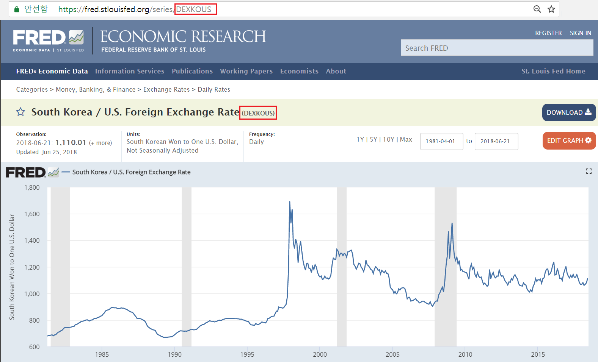
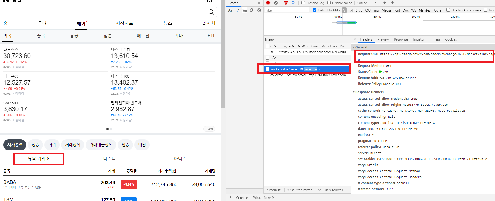
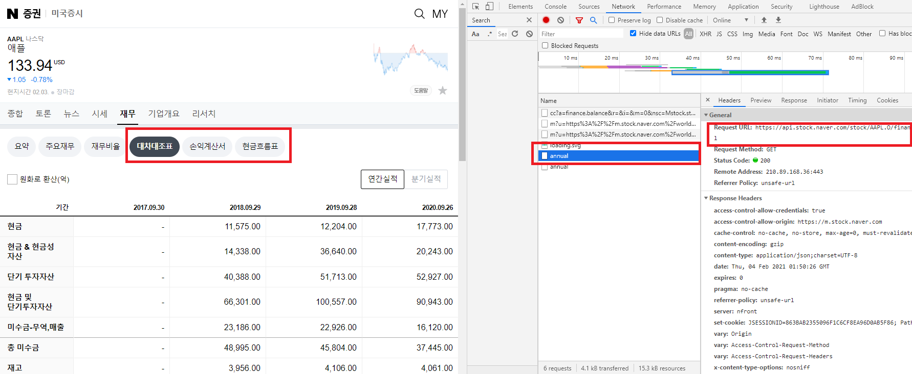
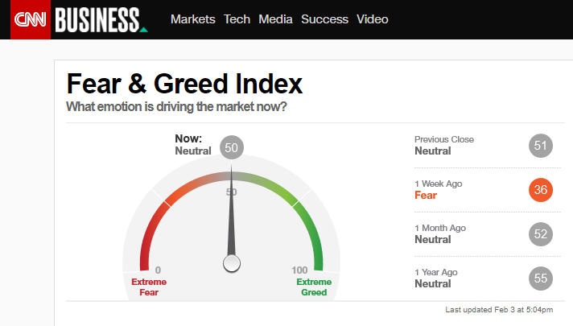
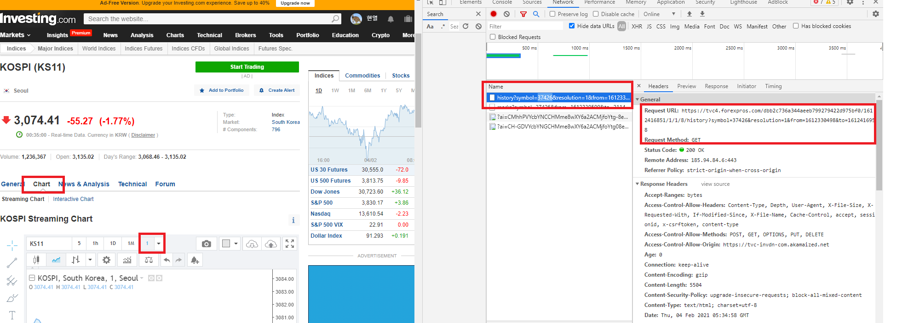

```{r setup, include=FALSE}
knitr::opts_chunk$set(
  echo = TRUE,  warning = FALSE, message = FALSE,
  fig.show = 'hold', fig.align = 'center', fig.pos = 'h',  out.width = "100%"
)

pdf.options(family = "Korea1deb")

library(magrittr)
```

# All You Need is Data

- 국내 투자든 해외 투자든 하려면 필요한 것? 데이터!
- 국내 주식: https://hyunyulhenry.github.io/quant_cookbook/
- 해외 주식 역시도 크롤링으로 해결 가능!

# 경제 데이터 다운받기

- 미국 연방준비은행에서 관리하는 Federal Reserve Economic Data(FRED)
- quantmod 패키지의 `getsymbols()` 함수 통해 다운로드 가능
- 홈페이지 URL 끝에 문자가 티커

```{r echo = FALSE}

```
</br>
- BEI(Breakeven Inflation Rate) 다운로드 (티커: T10YIE)

```{r}
library(quantmod)
library(ggplot2)
library(highcharter)

getSymbols('T10YIE', src = 'FRED')

highchart(type = 'stock') %>%
  hc_add_series(T10YIE) %>%
  hc_scrollbar(enabled = TRUE)
```

# 주식 티커 다운받기

- 주식 데이터 다운로드의 기본, 티커(ticker)
- 국내는 6자리(예: 삼성은 005930), 해외는 영어 알파벳(예: 애플은 AAPL)
- 티커 리스트가 있어야 이를 바탕으로 각종 데이터 다운로드 가능
- 네이버 미국증시에서 모든 리스트 제공(뉴욕 거래소, 나스닥, 아멕스)

```
https://m.stock.naver.com/worldstock/index.html#/home/USA/marketValue/NYSE
```
- 개발자도구 화면 연 상태로 [뉴욕 거래소] 클릭
- 어디서 데이터 받아오는지 확인


```{r echo = FALSE}

```
</br>
```
https://api.stock.naver.com/stock/exchange/NYSE/marketValue?page=1&pageSize=20
```

- 접속해보면 JSON 형태로 데이터를 제공해줌
- pageSize= 뒤의 숫자가 한 페이지당 최대 제공가능 종목 수, 60이 맥스
- 첫번째 페이지 테스트로 긁어오기

```{r}
library(jsonlite)
library(dplyr)

url = paste0('https://api.stock.naver.com/stock/exchange/NYSE/marketValue?page=1&pageSize=60')
data = fromJSON(url, flatten = TRUE)

names(data)
```

- stocks 내에 원하는 데이터 있음
- 뽑고. 클렌징!

```{r}
library(readr)

data = as_tibble(data$stocks)
head(data, 3)

data = data %>% 
  select(reutersCode, symbolCode, stockName, stockNameEng, closePrice, accumulatedTradingValue, accumulatedTradingValue,
         marketValue, dividend, `stockExchangeType.name`, `industryCodeType.industryGroupKor`) %>%
  mutate(closePrice = parse_number(closePrice),
         accumulatedTradingValue = parse_number(accumulatedTradingValue),
         marketValue = parse_number(marketValue),
         dividend = parse_number(dividend))

head(data, 3)
```

## 전 종목 티커 다운로드

- 위 코드를 함수로 묶고, for loop 돌려서 전 거래소에 대해 적용

```{r eval = FALSE}
# 함수로 묶기
down_data = function(ex) {
  
  data_list = list()
  
  tryCatch({
    
    for (i in 1 : 100) {
      
      url = paste0('https://api.stock.naver.com/stock/exchange/',ex,'/marketValue?page=',i,'&pageSize=60')
      data = fromJSON(url, flatten = TRUE)
      
      data = as_tibble(data$stocks)
      
      data = data %>% 
        select(reutersCode, symbolCode, stockName, stockNameEng, closePrice, accumulatedTradingValue, accumulatedTradingValue,
               marketValue, dividend, `stockExchangeType.name`, `industryCodeType.industryGroupKor`) %>%
        mutate(closePrice = parse_number(closePrice),
               accumulatedTradingValue = parse_number(accumulatedTradingValue),
               marketValue = parse_number(marketValue),
               dividend = parse_number(dividend))
      
      
      if (length(data) > 1) {
        data_list[[i]] = data
      } else {
        break
      }
      Sys.sleep(1)
    }
    
  }, error = function(e) {} )
  
  data_bind = bind_rows(data_list)
  
}

ticker_nyse = down_data('NYSE')
ticker_nasdaq = down_data('NASDAQ')
ticker_amex = down_data('AMEX')

ticker = rbind(ticker_nyse, ticker_nasdaq, ticker_amex)
```

```{r eval = FALSE, echo = FALSE}
write.csv(ticker, 'ticker.csv', row.names = FALSE)
```

```{r echo = FALSE}
ticker = read.csv('ticker.csv')
```

## 클렌징 하기

- 총 `r nrow(ticker)` 개의 종목이 존재
- 그러나 몇개는 투자할 수 없는 종목 혹은 중복된 종목 존재
- 클렌징 ㄱㄱ!

1. 종가 0 인 종목들: 대부분 펀드

```{r}
ticker %>% filter(closePrice == 0) %>% head(3)
```

2. ADR 들어간 종목: 미국 종목이 아님

```{r}
library(stringr)

ticker %>% filter(str_detect(stockNameEng, 'ADR')) %>% head(3)
```

3. Fund 들어간 종목

```{r}
ticker %>% filter(str_detect(stockNameEng, 'Fund')) %>% head(3)
```

4. Acquision 들어간 종목: 인수합병용 회사

```{r}
ticker %>% filter(str_detect(stockNameEng, 'Acquisition')) %>% head(3)
```

5. PRF 들어간 종목: 우선주

```{r}
ticker %>% filter(str_detect(stockNameEng, 'PRF')) %>% head(3)
ticker %>% filter(str_detect(stockName, 'Pref')) %>% head(3)
```

6. 다중 클래스

- 종목명에 아래 캐릭터 들어간 종목은 클래스 여러개 상장된 경우
- 아래 캐릭터 지운 다음에 중복된 종목 제거하여 클렌징

```{r}
c('II', 'III', 'IV', 'V', '\\.', 'Class A', 'Class B', 'Class C', 'Class D', 'Class E',
             'Unit', 'Series A', 'Series B', 'Series C', 'Series D', 'Series E')
```

- 위 사항 고려해서 클렌징해주기

```{r}
spe_char = c('II', 'III', 'IV', 'V', '\\.', 'Class A', 'Class B', 'Class C', 'Class D', 'Class E',
             'Unit', 'Series A', 'Series B', 'Series C', 'Series D', 'Series E') %>%
  str_c(., collapse="|")

ticker_mod = ticker %>% filter(closePrice != 0) %>%
  filter(!str_detect(stockNameEng, 'ADR')) %>%
  filter(!str_detect(stockNameEng, 'Fund')) %>%
  filter(!str_detect(stockNameEng, 'Acquisition'))  %>%
  filter(!str_detect(stockName, 'Pref')) %>%
  filter(!str_detect(stockNameEng, 'PRF')) %>%
  distinct(stockName, .keep_all = TRUE) %>%
  distinct(stockNameEng, .keep_all = TRUE) %>%
  mutate(clean_name = str_remove_all(stockNameEng, spe_char)) %>%
  distinct(clean_name, .keep_all = TRUE)
```

- 종목수가 `r nrow(ticker)`에서 `r nrow(ticker_mod)`개로 줄어듬
- 일단 저장

```{r}
write.csv(ticker_mod, 'ticker_mod.csv', row.names = FALSE)
```

# 종목정보

- 역시나 네이버에서 제공해줌 (ㄳㄳ)
- 3대 항목인 [대자대조표 / 손익계산서 / 현금흐름표] 클릭해보면 어디서 데이터 오는지 확인 가능

```{r echo = FALSE, fig.cap='애플 재무 항목'}

```

```
연간: https://api.stock.naver.com/stock/AAPL.O/finance/balance/annual
분기: https://api.stock.naver.com/stock/AAPL.O/finance/balance/quarter
```
- 위 url 들어가보면 JSON 형태로 데이터 제공
- url 분해
  - AAPL.O : 다운받은 티커항목에서 reutersCode 열에 해당
  - balance: 재무제표 항목에 해당, 손익계산서는 income, 현금흐름표는 cash
  - 연간은 annual, 분기는 quarter
  
- 대차대조표 크롤링하기

```{r}
url_bs = 'https://api.stock.naver.com/stock/MSFT.O/finance/balance/annual'
data_bs = fromJSON(url_bs, flatten = TRUE)
str(data_bs)
```

- rowList 리스트에 원하는 항목 있음

```{r}
data_bs = as_tibble(data_bs$rowList)

head(data_bs, 5)
```
- title과 value(달러 표시)만 선택해서 클렌징

```{r}
library(tibble)

data_bs = data_bs %>% select('title', contains('value')) %>%
  column_to_rownames('title')

data_bs = data_bs %>%
  sapply(., function(x) {
    str_replace_all(x, ',', '') %>%
      as.numeric()
  }) %>%
  data.frame(., row.names = rownames(data_bs)) %>%
  set_colnames(colnames(data_bs) %>% str_remove_all('\\.') %>% parse_number())

head(data_bs, 3)
```
- 클렌징 부분은 간단하게 함수로 짜두기

```{r}
# 클렌징 부분 함수로
data_clean = function(url) {
  data = fromJSON(url, flatten = TRUE)
  data = as_tibble(data$rowList)
  
  data = data %>% select('title', contains('value')) %>%
    column_to_rownames('title')
  
  data = data %>%
    sapply(., function(x) {
      str_replace_all(x, ',', '') %>%
        as.numeric()
    }) %>%
    data.frame(., row.names = rownames(data)) %>%
    set_colnames(colnames(data) %>% str_remove_all('\\.') %>% parse_number())
}
```

- 3대 재무제표 다운로드

```{r}
data_bs_a = data_clean('https://api.stock.naver.com/stock/AAPL.O/finance/balance/annual')
data_income_a = data_clean('https://api.stock.naver.com/stock/AAPL.O/finance/income/annual')
data_cash_a = data_clean('https://api.stock.naver.com/stock/AAPL.O/finance/cash/annual')
data_bind_a = bind_rows(data_bs_a, data_income_a, data_cash_a) %>% select(sort(names(.)))

head(data_bind_a)
```
- 기업 설명도 다운로드

```{r}
url_overview = 'https://api.stock.naver.com/stock/AAPL.O/overview'
data_overview = fromJSON(url_overview)

data_overview = data.frame(num = data_overview$stockItemListedInfo$countOfListedStock,
                           mv = data_overview$stockItemListedInfo$marketValueFull %>% parse_number(),
                           ex = data_overview$stockItemListedInfo$stockExchange,
                           summary = data_overview$summary)

head(data_overview)
```
- 한번에 함수로 짜기: 3대 재무제표 연간/분기 및 기업정보 다운로드

```{r}
# 클렌징
data_clean = function(url) {
  data = fromJSON(url, flatten = TRUE)
  data = as_tibble(data$rowList)
  
  data = data %>% select('title', contains('value')) %>%
    column_to_rownames('title')
  
  data = data %>%
    sapply(., function(x) {
      str_replace_all(x, ',', '') %>%
        as.numeric()
    }) %>%
    data.frame(., row.names = rownames(data)) %>%
    set_colnames(colnames(data) %>% str_remove_all('\\.') %>% parse_number()) %>%
    select(sort(names(.)))
}

data_down = function(ticker) {
  
  # 기업정보
  url_overview = paste0('https://api.stock.naver.com/stock/', ticker, '/overview')
  data_overview = fromJSON(url_overview)
  data_overview = data.frame(num = data_overview$stockItemListedInfo$countOfListedStock,
                             mv = data_overview$stockItemListedInfo$marketValueFull %>% parse_number(),
                             ex = data_overview$stockItemListedInfo$stockExchange,
                             summary = data_overview$summary)
  write.csv(data_overview, paste0(ticker, '_overview.csv'))
  
  # 재무재표 (연간)
  data_bs_a = data_clean(paste0('https://api.stock.naver.com/stock/',ticker,'/finance/balance/annual'))
  data_income_a = data_clean(paste0('https://api.stock.naver.com/stock/',ticker,'/finance/income/annual'))
  data_cash_a = data_clean(paste0('https://api.stock.naver.com/stock/',ticker,'/finance/cash/annual'))
  data_bind_a = bind_rows(data_bs_a, data_income_a, data_cash_a) %>% select(sort(names(.)))
  write.csv(data_bind_a, paste0(ticker, '_annual.csv'))
  
  # 재무제표 (분기)
  data_bs_q = data_clean(paste0('https://api.stock.naver.com/stock/',ticker,'/finance/balance/quarter'))
  data_income_q = data_clean(paste0('https://api.stock.naver.com/stock/',ticker,'/finance/income/quarter'))
  data_cash_q = data_clean(paste0('https://api.stock.naver.com/stock/',ticker,'/finance/cash/quarter'))
  data_bind_q = bind_rows(data_bs_q, data_income_q, data_cash_q) %>% select(sort(names(.)))
  write.csv(data_bind_q, paste0(ticker, '_quarter.csv'))
  
  Sys.sleep(1)
  
}
```

```{r}
data_down('AAPL.O')
```

- 폴더 확인해보면 **티커_annual.csv, 티커_quarter.csv, 티커_overview.csv** 저장되있음
- 티커 리스트에서 for loop 돌리면 전 종목 데이터 다운로드 가능

# 주가 다운로드

- `getSymbols()` 함수로 매우 손쉽게 다운로드 가능
- 해당 함수쓰면 야후 파이낸스 API로 데이터 다운로드 알아서 해줌
- 티커 리스트에서 reutersCode가 아니라 **symbolCode** 이용해야 함

```{r}
getSymbols('AAPL', from = '1900-01-01')
```

```{r}
head(AAPL)
```

- Open: 시가
- High: 고가
- Low: 저가
_ Close: 종가
- Volumn: 거래량
- Adjusted: 수정주가

```{r}
Ad(AAPL) %>% chart_Series()
```

# 기타 투자에 도움되는 지표들

## Shiller CAPE (US)

- 노벨 경제학상에 빛나는 쉴러교수가 만든 지표
- 설명: https://blog.naver.com/alex267/221785161844
- https://www.multpl.com/shiller-pe/table/by-month 에서 확인 가능

```{r}
library(rvest)
library(httr)
library(dplyr)
library(lubridate)
library(stringr)
library(magrittr)
library(highcharter)
library(timetk)

Sys.setlocale("LC_ALL", "English")

url = 'https://www.multpl.com/shiller-pe/table/by-month'
data = GET(url)

data_table = data %>% read_html() %>% html_table() %>% .[[1]]

head(data_table)

data_table = data_table %>%
  mutate(Date = as.Date(Date, format = "%B %d, %Y")) %>%
  set_colnames(c('Date', 'Value')) %>%
  tk_xts()

highchart(type = 'stock') %>%
  hc_add_series(data_table) %>%
  hc_scrollbar(enabled = TRUE)
```

- 이 외에도 https://www.multpl.com/sitemap 에서 다양한 지표를 위와 같은 방법으로 다운 가능!

## Global CAPE

- 전세계 CAPE 지수를 starcapital이라는 곳에서 계산해줌
- 역사적 데이터는 없음. 시차 약간 존재

```{r}
library(jsonlite)
library(magrittr)
library(dplyr)
library(httr)
library(rvest)
library(tidyr)
library(tibble)
library(DT)

url = 'https://www.starcapital.de/fileadmin/charts/Res_Aktienmarktbewertungen_FundamentalKZ_Tbl.php?lang=en'
data = fromJSON(url)

head(data)

col_name = data$cols$label

global_cape = data$rows %>% lapply(., data.frame) %>% .$c %>% t() %>% set_colnames(col_name) %>%
  data.frame() %>% set_rownames(NULL) %>%
  mutate_at(vars(-c('Country')), as.numeric) %>%
  arrange(Score)

head(global_cape)
```

- Weight: 글로벌 비중
- CAPE: CAPE 지수
- PE: Price To Earning
- PC: Price to Cashflow
- PB: Price to Book Value
- PS: Price to Sales
- DY: 배당수익률
- RS26W: 26주 기준 RSI
- RS52W: 52주 기준 RSI
- Score: 종합점수

```{r}
global_cape %>% datatable()
```

## Fear & Greed

- CNN에서 제공하는 주식시장 과열/침체 정도의 점수
- https://money.cnn.com/data/fear-and-greed/

```{r echo = FALSE}

```
</br>
- 과열 단계(80 이상)에서는 매도, 공포 단계(20 이하)에서는 매수하면 개꿀


```{r}
library(rvest)
library(httr)
library(readr)
library(plotly)

url = 'https://money.cnn.com/data/fear-and-greed/'
web = GET(url)

fear_data = web %>% read_html() %>% html_nodes('#needleChart') %>%
  html_nodes('ul') %>%
  html_nodes('li') %>%
  html_text() 

head(fear_data)
```

- 현재 기준만 차트로 나타냄

```{r}
plot_ly(
  domain = list(x = c(0, 1), y = c(0, 1)),
  value = fear_data[1] %>% parse_number,
  title = list(text = "Fear & Greed"),
  type = "indicator",
  mode = "gauge+number",
  gauge = list(
    axis = list(range = list(NULL, 100), tickwidth = 1, tickcolor = "black"),
    bar = list(color = "black"),
    bgcolor = "white",
    borderwidth = 2,
    bordercolor = "gray",
    steps = list(
      list(range = c(0, 10), color = "#ff1a1a"),
      list(range = c(10, 20), color = "#ff531a"),
      list(range = c(20, 30), color = "#ff8c1a"),
      list(range = c(30, 40), color = "#ffc61a"),
      list(range = c(40, 50), color = "#ffff1a"),
      list(range = c(50, 60), color = "#bfff00"),
      list(range = c(60, 70), color = "#80ff00"),
      list(range = c(70, 80), color = "#40ff00"),
      list(range = c(80, 90), color = "#00ff00"),
      list(range = c(90, 100), color = "#00ff40")
    ),
    threshold = list(
      line = list(color = "red", width = 4),
      thickness = 0.75,
      value = 80)) 
  ) %>%
  layout(margin = list(l=20,r=30),
         paper_bgcolor = "lavender")
```

## 인베스팅닷컴

- 투자 소스의 끝판왕이지만, 크롤링하기 어렵게 짜둠
- 셀레니움 사용할 경우 왠만한 데이터 모두 크롤링 가능
- 일부 페이지는 그냥 허무하게 뚤리기도 함....

### 세계 주요 주가지수

- https://www.investing.com/indices/major-indices
- 그냥 크롤링 하면 나옴 테이블 긁힘...

```{r}
url = 'https://www.investing.com/indices/major-indices'
data = GET(url)
data_table = data %>% read_html() %>% html_table()
data_table[[1]] %>% select(Index, Last, `Chg. %`) %>%
  datatable()
```

- 비슷한 형태로 여러 테이블 크롤링 가능

### 틱 데이터

- 차트에서 제공하는 틱/분/시/일/월/년 주가 데이터 크롤링 가능
- https://www.investing.com/indices/kospi-chart 접속
- [Chart 클릭] → [개발자도구 화면 열기] → [1] 선택 → [history?symbol=....]

```{r echo = FALSE}

```
</br>
- url 다음과 같음

```
https://tvc4.forexpros.com/dbb2c736a344aeeb799279422d975bf0/1612416851/1/1/8/history?symbol=37426&resolution=1&from=1612330498&to=1612416958
```
- symbol: 코스피 티커
- resolution: n분(틱) 데이터 
- from: 시작시점. as.POSIXct 형태(1970년 1월 1일 시작)
- to: 종료시점. as.POSIXct 형태(1970년 1월 1일 시작)

- 위에 4가지 바꾸면 다양한 차트로 변경 가능

```{r}
url = 'https://tvc4.forexpros.com/dbb2c736a344aeeb799279422d975bf0/1612416851/1/1/8/history?symbol=37426&resolution=1&from=1612330498&to=1612416958'

data = fromJSON(url)
data = data %>% data.frame() %>% select(t, c, o, h, l) %>%
  mutate_all(as.numeric) %>%
  mutate(t = as.POSIXct(t, origin="1970-01-01"))

head(data)
```

- t: time. 시간
- c: close. 종가
- o: open. 시가
- h: high. 고가
- l: low. 저가

```{r}
i = list(line = list(color = 'red'))
d = list(line = list(color = 'blue'))

data %>% 
  plot_ly(x = ~t, type="candlestick",
          open = ~data$o, close = ~data$c,
          high = ~data$h, low = ~data$l,
          increasing = i, decreasing = d) %>%
  layout(xaxis = list(title = NA),
         yaxis = list(title = '(%)'))
```


