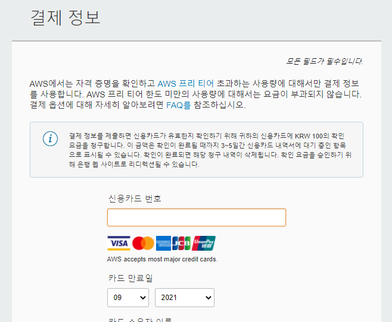
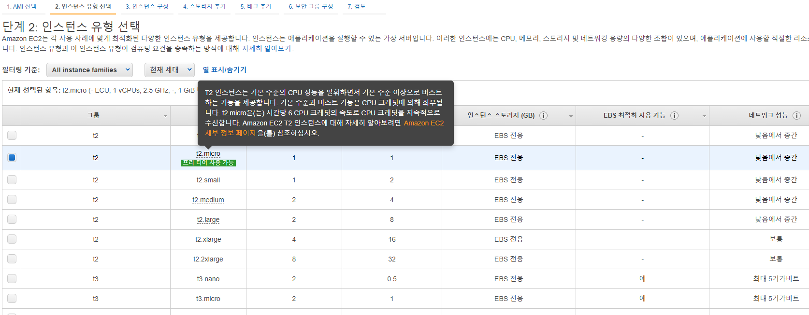

```{r setup, include=FALSE}
knitr::opts_chunk$set(
  echo = TRUE,  warning = FALSE, message = FALSE,
  fig.show = 'hold', fig.align = 'center', fig.pos = 'h',  out.width = "70%"
)
pdf.options(family = "Korea1deb")
```

# AWS EC2 인스턴스 만들고 접속하기

아마존 웹서비스(AWS: Amazon Web Service)를 통해 가상 서버를 이용할 경우 PC가 없이도 코딩 작업을 24시간 수행할 수 있습니다.

## AWS 인스턴스 만들기

먼저 AWS ID를 만들도록 합니다.

```{r fig.cap='AWS ID 만들기', echo = FALSE}

```

https://aws.amazon.com/ko/ 에서 계정을 만들며, [국가/리전]은 대한민국을 선택합니다.

```{r fig.cap='AWS 카드 등록하기', echo = FALSE}

```

추후 결제를 위한 카드를 등록합니다. 해당 카드를 통해 1달러가 결제되지만 추후 환불이 됩니다.

```{r fig.cap='AWS 플랜선택', echo = FALSE}
knitr::include_graphics('images/01_aws_plan.png')
```

무료인 [기본 플랜]을 선택합니다. 


```{r fig.cap='EC2 생성하기', echo = FALSE}

```

계정 생성이 완료된 후 서비스에서 [EC2]를 선택한 후 [인스턴트 시작] 버튼을 누릅니다. 주의할 점은 서비스 상태가 아시아 태평양(서울)로 선택되어 있어야 한다는 점이며, 만일 다른 지역일 경우 상단부의 지역선택란을 통해 해당 지역으로 변경할 수 있습니다.

```{r fig.cap='AMI 선택하기', echo = FALSE}

```

1번 단계인 AMI 선택에서 Ubuntu Server SSD Volume Type을 선택합니다.


```{r fig.cap='인스턴스 선택하기', echo = FALSE}

```

2번 단계인 인스턴스 유형 선택에서는 t2.micro를 선택한 후 하단의 [다음: 인스턴스 세부 정보 구성]을 누릅니다. t2.micro 유형은 최초 12개월 내 일정 시간 동안 무료로 사용이 가능하며, 무료 기간 이후에도 요금이 매우 저렴하기에 적합합니다. 만일 더 높은 사양을 원할 시 추후 다른 유형으로 변경도 가능합니다.

```{r fig.cap='보안 그룹 구성', echo = FALSE, out.width = "100%"}

```

3~5 단계는 선택사항이 없으므로 바로 6번 단계인 보안 그룹 구성으로 이동하며, 다음과 같이 같이 입력합니다.

1. Login: 유형은 [SSH], 포트범위는 [22], 소스는 [위치무관]을 선택합니다.
2. Password: 유형은 [HTTP], 포트범위는 [80], 소스는 [위치무관]을 선택합니다.
3. R Studio: 유형은 [사용자 지정 TCP 규칙], 포트범위는 [8787], 소스는 [위치무관]을 선택합니다.
4. R Shiny Server: 유형은 [사용자 지정 TCP 규칙], 포트범위는 [3838], 소스는 [위치무관]을 선택합니다.

```{r fig.cap='키 페어 생성', echo = FALSE, out.width = "100%"}

```
7번 단계에서 [시작하기]를 누르면 EC2 인스턴스에 접속할 수 있는 키 페어를 생성하기 위한 팝업이 뜹니다. [새 키페어 생성]을 선택하고 이름을 입력한 뒤 다운로드 버튼을 누르면 pem 확장자의 파일이 생성되며, 해당 파일은 매우 중요하므로 잘 보관해야 합니다.

```{r fig.cap='인스턴스 확인하기', echo = FALSE}

```

인스턴스 생성이 완료되면 상태를 확인할 수 있습니다.

## Putty를 이용한 서버 접속하기

EC2 인스턴스에 접속하기 위해서 Putty 프로그램을 이용해야 하며, 아래 사이트에서 다운로드 받을 수 있습니다. 본인의 OS에 맞는 설치파일을 다운로드 받은 후 설치합니다.

https://www.chiark.greenend.org.uk/~sgtatham/putty/latest.html

```{r fig.cap='Putty 다운로드', echo = FALSE}

```

EC2 인스턴스에 접속하기 이전에, 위에서 받은 pem 형식의 키 페어를 ppk 형식으로 변환해야 하며, Putty 설치시 함께 설치되는 puttygen 프로그램을 통해 해당 작업을 수행합니다

```{r fig.cap='puttygen', echo = FALSE}

```

1. Load an existing private key file의 [Load] 버튼을 누른 후 파일 형식을 All files로 변경하여 미리 다운로드 받은 pem 형식의 키 파일을 선택합니다.
2. Type of key to generate(생성할 키 유형)에서 RSA를 선택하며, 구버전의 PuTTYgen을 사용하는 경우 SSH-2 RSA를 선택합니다.
3. Save the generated key 부분에서 [Save private key]를 누르면 ppk 형식의 키 파일이 저장됩니다.

이제 Putty 프로그램을 통해 EC2 인스턴스에 접속해보도록 하겠습니다.

```{r fig.cap='퍼블릭 IP 확인', echo = FALSE}

```

```{r fig.cap='퍼블릭 IP 입력', echo = FALSE}

```

AWS 홈페이지에서 IPv4 퍼블릭 IP에 해당하는 주소를 복사한 후, Putty의 Host Name에 입력합니다. Port와 Connection type은 각각 기본값인 22와 SSH를 유지합니다.

```{r fig.cap='키 파일 입력하기', echo = FALSE}

```

좌측의 [SSH → Auth]를 선택한 후 [Private key file for authentication] 부분의 [Browse] 버튼을 눌러 위에서 생성한 ppk 형식의 키 페어 파일을 선택합니다.

```{r fig.cap='Putty 로그인하기', echo = FALSE}

```

다시 좌측 상단의 Session으로 돌아와 [Save]를 눌러 셋팅을 저장한 후, 하단의 [Open]을 눌러 EC2 인스턴스에 접속합니다.

```{r fig.cap='Putty 로그인하기', echo = FALSE}

```

PuTTY Security Alert 팝업창에서 [예(Y)]를 누른 후, 터미널에 ubuntu를 입력하면 Ubuntu 서버에 접속이 됩니다.

# R, R studio 설치 및 패키지 설치하기

## R 설치하기

Ubuntu 서버에 R을 설치하기 위해 다음과 같이 입력합니다.

```
sudo -i
sudo apt-get update
sudo apt-get install r-base
```

1. 먼저 sudo -i를 통해 root 권한을 실행합니다.
2. 패키지들을 업데이트 합니다.
3. R을 설치합니다.

```{r fig.cap='R 실행하기', echo = FALSE}

```

터미널에서 `R`을 입력하면 R Gui를 실행할 수 있습니다. 시험상아 각종 함수들을 실행해본 후, R의 종료 명령어인 `q()`를 입력합니다.


## R Studio 설치하기

Ubuntu에서 R Studio를 설치하기 위해서는 R Studio 사이트를 방문하여 버젼에 맞는 명령어를 찾아 입력하면 됩니다.

https://www.rstudio.com/products/rstudio/download-server/

```{r fig.cap='R Studio 설치하기', echo = FALSE}

```

```
sudo apt-get install gdebi-core
wget https://download2.rstudio.org/server/bionic/amd64/rstudio-server-1.3.1093-amd64.deb
sudo gdebi rstudio-server-1.3.1093-amd64.deb
```

## 사용자 추가

사용자를 추가하기 위해 다음과 같이 입력합니다.


```
sudo adduser 유저이름
```

```{r fig.cap='유저 추가하기', echo = FALSE}
knitr::include_graphics('images/01_aws_add_user.png')
```

입력한 유저이름으로 사용자가 추가됩니다. password의 경우 타이핑을 해도 아무것도 입력 되지 않은 것 처럼 보이지만 입력이 되고 있으며, 기타 정보는 엔터를 눌러 건너뛰어도 됩니다. 만일 여러 사용자를 추가하고 싶으면 위 과정을 반복하면 됩니다.

## 웹에서 R Studio 실행하기

이제 웹에서 R Studio를 실행하도록 하겠습니다. 퍼블릭 DNS(IPv4) 주소 뒤에 R Studio의 포트번호인 **:8787**를 붙인 값이 R Studio Server의 주소입니다.

```{r fig.cap='유저 추가하기', echo = FALSE}

```

```{r fig.cap='웹에서 R Studio 실행하기', echo = FALSE}
knitr::include_graphics('images/01_aws_web_login.png')
```


서버 주소(DNS:8787)를 웹브라우저에 입력하면 로그인 화면이 뜨며, 미리 생성한 사용자 이름과 비밀 번호를 입력하면 R Studio가 실행됩니다.

현재는 R과 R Studio에서 제공하는 기본 패키지만 설치된 상태이며, 추가로 필요한 소프트웨어와 패키지들을 설치해야 합니다. 먼저 Putty를 통해 Ubuntu 커맨드에서 다음 명령어를 입력하여 필요한 소프트웨어들을 설치합니다. (root 계정으로 설치하는 것을 권장합니다.)

```
sudo apt-get install libcurl4-openssl-dev
sudo apt-get install libxml2-dev
sudo apt-get install libssl-dev
sudo apt-get install libpq-dev
sudo apt-get install libfreetype6-dev
sudo apt-get install r-cran-rcpp
sudo apt-get install r-cran-rmysql
```

```{r fig.cap='패키지 설치하기', echo = FALSE}

```

다시 웹으로 R Studio에 접속한 후 사용하고자 하는 패키지들을 설치합니다.

