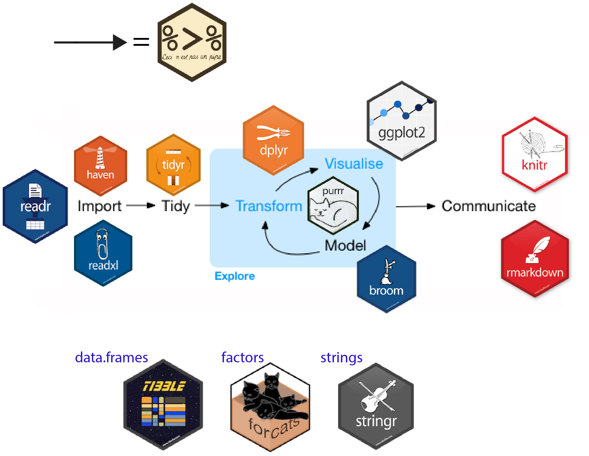
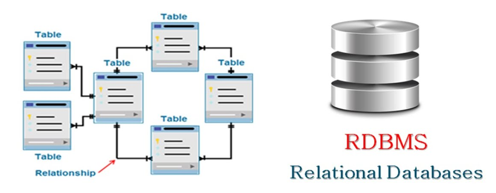
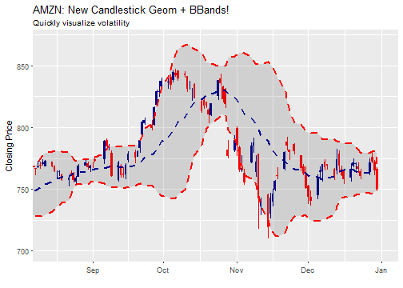
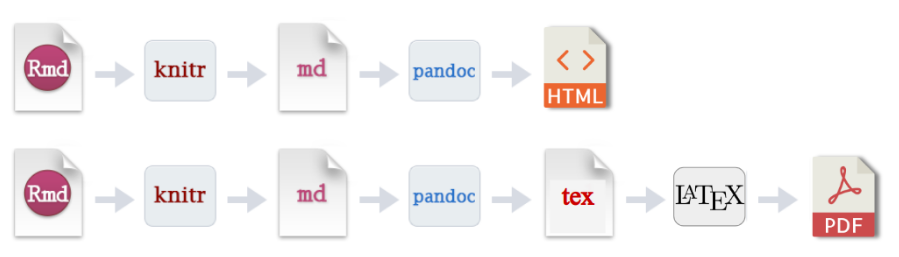

```{r setup, include=FALSE}
knitr::opts_chunk$set(
  echo = TRUE,  warning = FALSE, message = FALSE,
  fig.show = 'hold', fig.align = 'center', fig.pos = 'h',  out.width = "70%"
)
```

# 개요

데이터 과학의 업무 진행 과정은 다음과 같다.


```{r fig.cap='데이터 과학 업무 과정', echo = FALSE}
knitr::include_graphics('ds_flow.png')
```
R 내에서 이러한 데이터 분석을 편하게 하기 위해서는 tidyverse 패키지가 만들어 낸 생태계를 이해할 필요가 있다. tidyverse란 R studio에서 만든 패키지 중 핵심 패키지들을 묶은 Package of Packages로써, R 언어의 대표적 인물인 Hadley Wickham, R studio의 창업자인 JJ Allaire, 언어와 시각화를 전담하는 Yihui Xie 등의 R Studio 직원이 전담하여 패키지들을 만들고 업데이트 중이다. (https://www.tidyverse.org/)

데이터 과학이 업무 과정 별 사용되는 패키지는 다음과 같다.

```{r fig.cap='데이터 과학 업무 과정 별 패키지', echo = FALSE}

```

# 데이터 불러오기 (import)

회사의 서버에 저장된 데이터를 불러와야 데이터 분석을 할 수 있다. 그러나 실무에서는 그보다 먼저 데이터의 수집 및 어떤 플랫폼에 저장할 지 제대로 정의해야, 수월한 데이터 분석을 수행할 수 있다.

## 데이터 수집 및 저장

제대로 된 데이터가 있어야 제대로 된 분석을 할 수 있다. 데이터 구매를 위해 비싼 비용을 사용하지만, 대부분의 데이터가 완벽하다고 말할 수는 없다. 해외 금융회사의 경우 여러 벤더로부터 데이터를 구매한 후 크로스체크를 통해 오류가 있는 데이터를 찾아내며, 주니어 퀀트의 경우 데이터 오류 검증을 하는 업무부터 시작해 나간다.

또한 분석을 하기 편한 플랫폼에 저장되어 있어야 빠른 데이터 분석이 가능하다. 예를 들어 raw data가 엑셀 형태로 되어있다면 관리도 쉽지 않고, 분석 하기에도 불편하다.

대부분 금융 데이터의 경우 주가, 재무제표 등 정형 데이터이므로, 데이터 저장에 RDBMS을 이용하는 것이 효율적이다. sql을 이용할 경우 원하는 데이터를 수초 내에 조회가 가능하다.

```{r fig.cap='RDBMS', echo = FALSE}

```

그러나 보험사와 같이 쌓이는 데이터의 양이 지나치게 만을 경우, 단순히 sql로 데이터를 처리하기에는 한계가 있다. 실제로 sql 쿼리를 통해 원하는 데이터를 한달치 뽑는데만 10분 정도가 소요되기도 했다. 몇년치에 해당하는 데이터를 모두 뽑는데만 몇 시간이 걸리고, 만일 오류가 있어서 다시 데이터를 뽑아야 한다면 그냥 하루가 날아간다.

이러한 '진짜' 빅데이터의 분석을 위해서는 RDBMS 보다 하둡이나 스파크, 카프카 등을 이용하는 것이 훨씬 좋다. 예를 들어 스파크의 경우 기존 sql과 비교해 월등히 빠른 속도와, 분석가들이 익숙한 R, Python, sql 문법을 그대로 사용할 수 있는 장점이 있다.

만일 sql로도 원하는 데이터를 '참을 만한 시간' 내에 조회가 가능하다면 그대로 사용을, 도저히 감당이 안될 정도이면 빅데이터 플랫폼으로 변경할 것을 추천하며, 이러한 플랫폼의 차이는 분석가의 업무가 아니긴 하지만 어느 정도는 알고 있어야 한다.

## 데이터 서버 접속 및 불러오기

데이터 서버가 구축되어 있다고, 무작정 R/Python을 이용해 서버에 접속하여 데이터를 내려받아 분석을 하는 것은 좋지 않다. 데이터의 용량이 클 경우 내려받는데만 수 시간이 걸릴 수 있으며, 제대로 처리하지 못할 수도 있다. 따라서 서버 내에서 최대한 원하는 형태까지 데이터를 가공한 후(기본 클랜징, 그룹핑, 원하는 기간과 컬럼만 선택 등) R/Python을 이용해 분석을 하는 편이 효율적이다.

그러나 이를 위해 데이터를 담당하는 사람에게 일일이 요청할 수는 없다. 일부 회사에서 원하는 형태로 데이터를 요청할 때 마다 부서 비용이 지출되기도 하고, 원하는 형태가 아닐 경우 재요청을 해야한다. 이 과정에서 비용 뿐만 아니라 며칠이 소요된다. 따라서 데이터를 분석하는 사람이라면 차라리 직접 서버에 접속해 원하는 데이터를 최대한 가공한 후, R/Python로 서버에 접속하여 데이터를 내려받는 것이 이상적이다. 이를 위해 기본적인 sql 문법도 알고 있어야 하며, 다행히도 dplyr 패키지를 공부하면 sql 문법도 자연스럽게 공부가 된다.

R의 경우 RJDBC, RODBC, ROrcacle 등의 패키지를 이용해 DB에 직접 연결할 수 있다.

- https://www.ibm.com/docs/ko/db2woc?topic=packages-rodbc-package

R과 서버를 연결시키면, R 내에서 직접 sql 쿼리를 날린 후 결과를 받을 수 있다. 따라서 다음과 같이 데이터 분석을 실행할 수 있다.

```{r eval = FALSE}
library(RODBC)
library(ggplot2)

# 서버 접속
con <- odbcConnect("IDADB", believeNRows=FALSE)

# 쿼리
query <- paste("select * from price_db where sec_code = '005930' and date between 2000-01-01 and 2020-12-31")

# 쿼리 날리기
df <- sqlQuery(con, query, stringsAsFactors = FALSE )

# R 내에서 데이터 분석
df %>%
  ggplot(aes(x = date, y = price)) +
  geom_line()
```

R에서 spark 역시 사용할 수 있다.

- SparkR: http://spark.apache.org/docs/latest/sparkr.html
- sparklyr: https://spark.rstudio.com/

zeppelin을 사용한다면 PySpark를 이용해 파이썬을 사용할 수도 있다.

- https://zeppelin.apache.org/docs/latest/interpreter/spark.html

**결국 중요한 것은 데이터 분석을 위한 raw data를 csv나 excel 형태로 받은 후 불러오는 것이 아닌, DB에 직접 연결해 프로그램 내에서 받아오는 파이프 라인을 설계하는 것이다. 이를 통해 분석가가 원하는 데이터를, 빠른 시간에, 오류없이 받아올 수 있다.**

# 데이터 정리하기 (tidy)

데이터 분석의 단계에서 가장 많은 시간을 할애하는 것이 데이터 정리하기, 즉 클랜징 단계이다. 데이터가 제대로 클랜징 처리가 되어야 분석이나 모델링을 하는 것이 가능하다. 다행히 금융 데이터는 데이터가 지저분한 형태로 들어오는 경우가 거의 없지만, 그래도 완벽하게 원하는 형태는 아니다. 더구나 비정형 데이터의 경우 클랜징 처리를 어떻게 하느냐에 따라 전혀 다른 결과가 나오기도 한다. 클랜징이 필요한 예를 들어보자.

- Date가 yyyymmdd 형태로 들어올 경우, time series 분석을 용이하게 하기 위해 yyyy-mm-dd 형태로 변경
- 시가총액이 '192,370,650' 처럼 character 형태로 들어올 경우 192370650 인 numeric 형태로 변경
- 수익률이 19.30 형태로 들어올 경우, 0.1930 으로 변경
- 컬럼이름 변경
- 결측치(NA) 처리

먼저 데이터의 전반적인 처리에는 tidyr 패키지가 사용된다. 그 외에도 팩터 처리에는 forcats, 시간 처리에는 lubridate, 문자 처리에는 stringr 패키지가 사용된다. 특히 금융 데이터는 대부분 시계열 형태로 들어오므로, lubridate 패키지가 많이 사용된다. 또한 magrittr 패키지의 파이프 오퍼레이터(%>%)를 사용해 데이터를 훨씬 직관적으로 처리할 수 있다. 

- tidyr: https://tidyr.tidyverse.org/
- forcats: https://forcats.tidyverse.org/
- lubridate: https://lubridate.tidyverse.org/
- stringr: https://stringr.tidyverse.org/

# 데이터 분석하기 (Explore)

원하는 데이터가 준비되었으면, 본격적으로 데이터를 분석해야 한다. 이 단계는 크게 변형, 시각화, 모델링으로 구분된다.

## 데이터 변형

먼저 각종 테이블을 하나로 합칠 필요가 있으며, 이 때는 `*_join()` 구문이 사용된다.

```{r fig.cap='join 구문의 종류', echo = FALSE}
knitr::include_graphics('join.png')
```

또한 데이터를 분석하기 위해 다음 함수가 대표적으로 사용된다.

- `select()`: 원하는 컬럼 선택
- `filter()`: 조건에 맞는 행 선택
- `mutate()`: 열 생성 및 데이터 변형
- `group_by()`: 그룹별로 데이터를 묶기

이 외에도 dplyr 패키지에는 데이터 분석을 위한 대부분의 함수가 포함되어 있다.

## 데이터 시각화

R의 가장 큰 강점은 데이터 시각화라고 말하는 사람도 있다. 그만큼 ggplot2 패키지를 이용해 데이터를 직관적으로 표현할 수 있다. 해당 패키지는 릴랜드 윌킨스(Leland Wilkinson)의 책 The Grammar of Graphics를 기본 철학으로 만들어졌다.

> “문법은 언어의 표현을 풍부하게 만든다. 단어만 있고 문법이 없는 언어가 있다면(단어 = 문장), 오직 단어의 갯수만큼만 생각을 표현할 수 있다. 문장 내에서 단어가 어떻게 구성되는 지를 규정함으로써, 문법은 언어의 범위를 확장한다.”
>
> — Leland Wilkinson, 《The Grammar of Graphics》

```{r fig.cap='ggplot 예시', echo = FALSE}

```

ggplot의 경우 인터넷에도 다양한 예제가 있으므로, 원하는 형태의 그림이 있을 시 얼마든지 검색이 가능하다.

- https://www.r-graph-gallery.com/ggplot2-package.html
- http://r-statistics.co/Top50-Ggplot2-Visualizations-MasterList-R-Code.html

## 모델링

기존의 R 내에 머신러닝 관련 패키지는 너무 분산되어 있었다. 그러나 Rstudio에서 통계분석, 머신러닝을 위한 tidymodel 세계관 구축 중이다. 

```{r fig.cap='tidymodel 패키지', echo = FALSE}
knitr::include_graphics('tidymodel.png')
```

- https://www.tidymodels.org/learn/

과거 해들리 위컴의 R4DS 책이 발간된 이후 tidyverse 생태계가 R의 메인으로 자리잡은 것 처럼, tidymodel 패키지가 완성된 후 책으로 나온다면 이 역시 새로운 세계관으로 자리잡지 않을까 생각한다. 현재 해당 패키지를 만들고 있는 개발자들이 관련 책도 함께 써나가고 있는 중이다.

- https://www.tmwr.org/

# 소통 (communicate)

혼자 일을 하지 않는 이상 결국 업무의 마무리는 문서화와 보고이다. 하지만 사내에서만 보는 문서를 굳이 한글이나 워드로 작성하는 것은 매우 비효율적이다. 코딩으로 나온 값을 다시 csv로 저장한 다음, 엑셀에서 가공하고, 그걸 다시 워드로 옮기고, 생각만 해도 숨막히는 작업이다. R에서 코딩으로 데이터 분석을 했다면, 결과물 역시 코딩으로 하는 것이 훨씬 효율적이다.

## Rmarkdown

Rmarkdown은 문서 내에서 코드(R, 파이썬 등)와 텍스트를 동시에 사용가능하여 효율적으로 문서를 작성할 수 있게 해준다. 만일 양식이 동일한 문서에서 기초 데이터만 매번 바뀌는 상황이라면, 기존의 환경에서는 매번 기초 데이터를 뽑아 문서로 작성해야 한다. 그러나 Rmarkdown을 이용한다면 데이터를 받는 것부터 문서화까지 코드로 만들어 두어 100% 자동화가 가능하다.

Rmarkdown은 기본적은 markdown 기능 외에도 latex, html(css)도 직접 사용 가능해 훨씬 아름다운 문서 작성이 가능하다. Rmarkdown을 이용한 문서화 과정은 다음과 같다. 

1. Rmd로 문서를 작성
2. knitr 패키지가 R 코드를 실행한 후 md 파일로 변환
3. pandoc 패키지가 각종 결과물로 변환 (HTML, PDF, Word, Presentation 등)

```{r fig.cap='Rmarkdown 프로세스', echo = FALSE}

```

실무적으로는 이러한 것들을 몰라도 Rmd 작성 테크닉만 알고 있다면, 작성 후 Knit 버튼을 누르기만 하면 문서가 만들어진다. 대부분의 경우 편하게 볼 수 있는 HTML 형태로 결과물을 생성하지만, 만일 보고용이라면 PDF로 결과물을 생성한 후, 프린트를 해도 된다. 

## Bookdown

Bookdown은 Rmarkdown의 파생 패키지로써, Rmd를 통해 웹북을 만들어 준다. 사내에서 업무 프로세스처럼 목차가 있는 문서를 만들어야 할 경우, 대부분 이파일 저파일 덕지덕지 저장해놓기 마련이며 관리도 되지 않는다. 만일 이러한 것들을 웹북 형태로 만들어 둔다면 통합적으로 관리하기 용이하며, 인덱싱이 되므로 검색하기도 편하다. 

https://hyunyulhenry.github.io/quant_cookbook/

## Shiny

Rmarkdown을 이용한 문서도 결과적으로 일차원적인 문서, 즉 보고자가 작성한 문서라는 한계가 있다. 그러나 보고를 받는 사람이 추가적인 데이터를 보고 싶을 경우, 예를 들어 운용중인 100개 펀드 리스트 중 원하는 펀드를 선택한 후, 원하는 날짜의 보유 종목을 확인하고자 할 경우, 매번 보고자가 해당 데이터를 뽑은 후 문서화를 해야 한다.

그러나 R의 Shiny를 이용할 경우 간편하게 앱을 만들 수 있으며, 이 모든 과정이 가능하다. 또한 Rmarkdown과 마찬가지로 DB 서버에 연결하는 코드까지 짜둘 경우, DB가 업데이트 됨에 따라 앱의 결과물 역시 최신 데이터를 보여준다. 사내에 샤이니를 제대로 만들 줄 아는 사람 한명만 있어도, 굳이 비싼 돈을 주고 tableau를 구매하지 않아도 되고, 확장성도 훨씬 넓다.

- https://vac-lshtm.shinyapps.io/ncov_tracker/

# 배포

코드를 저장하고, 완성된 문서를 배포하는 것 역시 중요하다. 먼저 코드 저장의 경우 Rstudio와 Github를 연동해두면, 매우 쉽게 Github로 코드를 업로드할 수 있다. 만일 사내에서 Gitlab을 사용한다면, 이 또한 좋은 저장 수단이다.

Github을 이용한다면 Rmarkdown으로 생성된 문서 역시 자동으로 url이 생성되므로, 문서를 공유하기 보다는 해당 url을 공유하는 것이 훨씬 좋다. 만일 데이터를 새로 분석하거나 양식이 바뀔 경우 파일을 공유하면 이래저래 꼬일 가능성이 있지만, url을 접속하면 최신 버젼의 파일이 자동으로 업데이트 되기 때문이다.

Shiny의 경우도 Rstudio를 통해 shinyapps.io에 업로드하여 url을 생성할 수 있다. 그러나 보안 등의 이슈로 사내에서만 봐야하는 결과물이라면, 사내에 Shiny server를 설치하여 사내전용 url을 생성하는 것 역시 가능하다. 또한 특정 부서만 접근이 가능하게 하려면 shinymanager 패키지를 통해 ID/PW를 부여할 수도 있다.

매일 자동으로 생성되는 문서가 있다면, 문서가 생성된 후 이메일이나 텔레그램으로 결과물을 전송하는 것 역시 가능하다. 매일 체크해기는 해야하지만 그 중요도가 낮은 문서의 경우, 이러한 자동화를 통해 출근길에 휴대폰으로 간단하게 확인하는 것 또한 가능하다.

- https://mailtrap.io/blog/r-send-email/