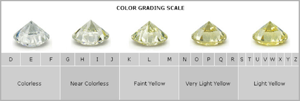

```{r setup, include=FALSE}
knitr::opts_chunk$set(echo = TRUE,
                      warning = FALSE,
                      message = FALSE,
                      out.width = "50%")
```

# 그래픽 문법

R에서 기본적으로 제공하는 `plot()` 함수를 이용해도 시각화가 충분히 가능합니다. 다음 사이트에는 기본 함수를 이용해 표현할 수 있는 다양한 그림이 나와 있습니다.

- http://www.sthda.com/english/wiki/r-base-graphs

그러나 기본 함수를 이용하여 시각화를 할 경우 다음과 같은 문제가 있습니다.

- 서로 다른 형태의 그림을 나타내기 위해 각각 다른 함수를 이용해야 함
- 표현할 수 있는 그림에 한계가 있음
- 원하는 형태로 꾸미기가 복잡함

ggplot2 패키지는 데이터 과학자들에게 가장 많이 사랑받는 패키지 중 하나이며, `ggplot()` 함수를 사용하면 그림을 훨씬 아름답게 표현할 수 있으며 다양한 기능들을 매우 쉽게 사용할 수도 있습니다. 처음에는 함수의 문법이 다소 어색하지만, 해당 패키지의 근본이 되는 철학인 그래픽 문법(The Grammar of Graphics)를 이해하고 조금만 연습해본다면, 충분히 손쉽게 사용이 가능합니다.

그래픽 문법(Grammar of Graphics)은 릴랜드 윌킨스(Leland Wilkinson)의 책 The Grammar of Graphics(Wilkinson 2012)에서 따온 것으로써, 데이터를 어떻게 표현할 것인지에 대한 내용입니다.

> 문법은 언어의 표현을 풍부하게 만든다. 단어만 있고 문법이 없는 언어가 있다면(단어 = 문장), 오직 단어의 갯수만큼만 생각을 표현할 수 있다. 문장 내에서 단어가 어떻게 구성되는 지를 규정함으로써, 문법은 언어의 범위를 확장한다.
>
> --- Leland Wilkinson, 《The Grammar of Graphics》

그래픽 문법에서 말하는 요소는 다음과 같습니다.

1. Data: 시각화에 사용될 데이터
2. Aesthetics: 데이터를 나타내는 시각적인 요소(x축, y축, 사이즈, 색깔, 모양 등)
3. Geometrics: 데이터를 나타내는 도형
4. Facets: 하위 집합으로 분할하여 시각화
5. Statistics: 통계값을 표현
6. Coordinates: 데이터를 표현 할 이차원 좌표계
7. Theme: 그래프를 꾸밈

```{r fig.cap='The Grammar of Graphics', echo = FALSE}
knitr::include_graphics('images/data_analysis_gg.png')
```

ggplot2 패키지의 앞글자가 gg인 것에서 알 수 있듯이, 해당 패키지는 그래픽 문법을 토대로 시각화를 표현하며, 전반적인 시각화의 순서는 그래픽 문법의 순서와 같습니다. ggplot2 패키지의 특징은 각 요소를 연결할 때 플러스(+) 기호를 사용한다는 점이며, 이는 그래픽 문법의 순서에 따라 요소들을 쌓아나간 후 최종적인 그래픽을 완성하는 패키지의 특성 때문입니다.

아래 사이트에는 R에서 ggplot2와 기타 패키지를 이용해 표현할 수 있는 그림이 정리되어 있습니다.

- https://www.r-graph-gallery.com/

# 데이터셋: 다이아몬드

ggplot2 패키지에는 데이터분석 및 시각화 연습을 위한 각종 데이터셋이 있으며, 그 중에서도 diamonds 데이터셋이 널리 사용됩니다. 먼저 해당 데이터를 불러오도록 하겠습니다.

```{r}
library(ggplot2)

data(diamonds)
head(diamonds)
```

데이터의 각 변수는 다음과 같습니다.

- carat: 다이아몬드 무게
- cut: 컷팅의 가치
- color: 다이아몬드 색상
- clarity: 깨끗한 정도
- depth: 깊이 비율, z / mean(x, y)
- table: 가장 넓은 부분의 너비 대비 다이아몬드 꼭대기의 너비
- price: 가격
- x: 길이
- y: 너비
- z: 깊이

```{r fig.cap='color', echo = FALSE, out.width="100%"}

```

```{r fig.cap='clarity', echo = FALSE, out.width="100%"}
knitr::include_graphics('images/diamond_clarity.png')
```

```{r fig.cap='table', echo = FALSE, out.width="100%"}
knitr::include_graphics('images/diamond_table.png')
```

이 외에도 R에서 제공하는 다양한 데이터셋은 다음의 함수를 통해 확인할 수 있습니다.

```{r eval = FALSE}
data()
```

```{r echo = FALSE}
z = data(package = .packages(all.available = TRUE))

head(c(z$results[,3]), 50)
```

# Data, Aesthetics, Geometrics

그래픽 문법의 순서에 맞춰 그림을 쌓아나가보도록 하겠습니다. 먼저 Data는 사용될 데이터이며, Aesthetics는 x축, y축, 사이즈 등 시각적인 요소를 의미합니다.

```{r}
ggplot(data = diamonds, aes(x = carat, y = price))
```

x축과 y축에 우리가 매핑한 carat과 price가 표현되었지만, 어떠한 모양(Geometrics)으로 시각화를 할지 정의하지 않았으므로 빈 그림이 생성됩니다. 다음으로 Geometrics을 통해 데이터를 그림으로 표현해주도록 하겠습니다.

```{r}
ggplot(data = diamonds, aes(x = carat, y = price)) +
  geom_point()
```

사전에 정의된 Data와 Aesthetics 위에, 플러스(+) 기호를 통해 `geom_point()` 함수를 입력하여 산점도가 표현되었습니다. geom은 Geometrics의 약자이며, 이처럼 `geom_*()` 함수를 통해 원하는 형태로 시각화를 할 수 있습니다.

일반적으로 Data는 `ggplot()` 함수 내에서 정의하기 보다는, dplyr 패키지의 함수들을 이용하여 데이터를 가공한 후 파이프 오퍼레이터(`%>%`)를 통해 연결합니다.

```{r}
library(magrittr)

diamonds %>%
  ggplot(aes(x = carat, y = price)) +
  geom_point(aes(color = cut, shape = cut))
```

diamonds 데이터를 파이프 오퍼레이터로 이을 경우 그대로 시각화가 가능하며, `ggplot()` 함수 내에 데이터를 입력하지 않아도 됩니다.

`geom_point()` 내부에서 aes()를 통해 점의 색깔을 매핑해줄 수 있습니다. `color = cut, shape = cut`을 지정하여 cut에 따라 점의 색깔과 형태를 다르게 표현하였습니다. 이 외에도 size 등을 통해 그룹별로 그래프를 각각 다르게 표현할 수 있습니다.

# Facets

Facets은 여러 집합을 하나의 그림에 표현하기 보다 하위 집합으로 나누어 시각화하는 요소입니다.

```{r}
diamonds %>%
  ggplot(aes(x = carat, y = price)) +
  geom_point() +
  facet_grid(. ~ cut)
```

`facet_grid()` 혹은 `facet_wrap()` 함수를 통해 그림을 분할할 수 있습니다. 물결 표시(~)를 통해 하위 집합으로 나누고자 하는 변수를 선택할 수 있으며, 위 예제에서는 cut에 따라 각기 다른 그림으로 표현되었습니다.

```{r}
diamonds %>%
  ggplot(aes(x = carat, y = price)) +
  geom_point() +
  facet_grid(color ~ cut)
```

color를 추가해 `facet_grid(color ~ cut)`를 입력하면 가로는 color, 세로는 cut으로 그림이 나누어집니다. 

# Statistics

Statistics는 통계값을 나타내는 요소입니다.

```{r}
head(diamonds)

diamonds %>%
  ggplot(aes(x = color  , y = carat)) +
  stat_summary_bin(fun = "mean", geom = "bar")
```

결과를 보면 color가 깨끗할 수록(D) 캐럿이 작으며, 더러울 수록(J) 캐럿이 큰 것 처럼 보입니다. 한편, 실무에서는 `stat_*()` 함수를 이용해 통계값을 나타내기 보다는, dplyr 패키지를 이용해 데이터의 통계값을 계산한 후 이를 그림으로 나타냅니다. 

```{r}
library(dplyr)

diamonds %>%
  group_by(color) %>%
  summarize(carat = mean(carat)) %>%
  ggplot(aes(x = color, y = carat)) +
  geom_col()
```

기존과 그래프가 정확히 일치합니다.

# Coordinates

Coordinates는 좌표를 의미합니다. ggplot2에서는 `coord_*() 함수를 이용하여 $x$축 혹은 $y$축 정보를 변형할 수 있습니다.

```{r}
diamonds %>%
  ggplot(aes(x = carat, y = price)) +
  geom_point(aes(color = cut)) +
  coord_cartesian(xlim = c(0, 3), ylim = c(0, 20000))
```

`coord_cartesian()` 함수를 통해 $x$축과 $y$축 범위를 지정해 줄 수 있습니다. xlim과 ylim 내부에 범위의 최소 및 최댓값을 지정해주면, 해당 범위의 데이터만을 보여줍니다.

```{r}
diamonds %>%
  ggplot(aes(x = carat, y = price)) +
  geom_boxplot(aes(group = cut))

diamonds %>%
  ggplot(aes(x = carat, y = price)) +
  geom_boxplot(aes(group = cut)) +
  coord_flip() 
```

`coord_flip()` 함수는 $x$축과 $y$축을 뒤집어 표현합니다. 위의 그림은 `ggplot()` 함수의 aes 내부에서 $x$축은 carat을, $y$축은 price를 지정해 주었지만, 아래 그림에서는 `coord_flip()` 함수를 통해 각 축이 서로 바뀌었습니다.

# Theme

Theme은 그림의 제목, 축 제목, 축 단위, 범례, 디자인 등 그림을 꾸며주는 역할을 담당합니다.

```{r}
diamonds %>%
  ggplot(aes(x = carat, y = price)) +
  geom_point(aes(color = cut)) +
  theme_bw() +
  labs(title = 'Relation between Carat & Price',
       x = 'Carat', y = 'Price') +
  theme(legend.position = 'bottom',
        panel.grid.major.x = element_blank(),
        panel.grid.minor.x = element_blank(),
        panel.grid.major.y = element_blank(),
        panel.grid.minor.y = element_blank()
        ) +
  scale_y_continuous(
    labels = function(x) {
      paste0('$', 
             format(x, big.mark = ','))
    })
```

`geom_point()` 함수 이후 Theme에 해당하는 부분은 다음과 같습니다.

1. `theme_bw()` 함수를 통해 배경을 흰색으로 설정합니다.
2. `labs()` 함수를 통해 그래프의 제목 및 $x$축, $y$축 제목을 변경합니다.
3. `theme()` 함수 내 legend.position을 통해 범례를 하단으로 이동합니다.
4. `theme()` 함수 내 panel.grid를 통해 격자를 제거합니다.
5. `scale_y_continuous()` 함수를 통해 $y$축에서 천원 단위로 콤마(,)를 붙여주며, 이를 달러($) 표시와 합쳐줍니다.

이 외에도 각종 테마를 적용해 얼마든지 원하는 그림을 꾸밀 수 있습니다. R에서 적용가능한 그래프의 테마는 다음과 같습니다.

- https://ggplot2.tidyverse.org/reference/ggtheme.html

# 각종 팁

원하는 형태로 그래프를 가공하고자 할 경우, 구글에 검색을 하면 얼마든지 원하는 답을 얻을 수 있습니다. 만약 범례를 지우고 싶을 경우, 구글에서 'remove legend ggplot'을 검색하도록 합니다.

```{r fig.cap='범례 지우기', echo = FALSE, out.width="100%"}

```

이를 통해 우리가 원하는 답을 쉽게 얻을 수 있습니다.

```{r fig.cap='범례를 지우는 코드', echo = FALSE, out.width="100%"}
knitr::include_graphics('images/remove_legend2.png')
```

또한 ggplot2 패키지 만으로도 나타낼 수 없는 그래프는 다양한 확장 패키지들을 통해 얼마든지 나타낼 수 있습니다. 

- https://exts.ggplot2.tidyverse.org/gallery/

해당 패키지에 대한 더욱 자세한 설명은 패키지들의 책을 살펴보시기 바랍니다. 해당 책은 온라인에서 무료로 확인할 수 있습니다.

- https://ggplot2-book.org/